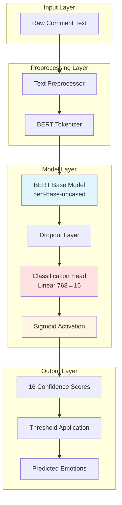
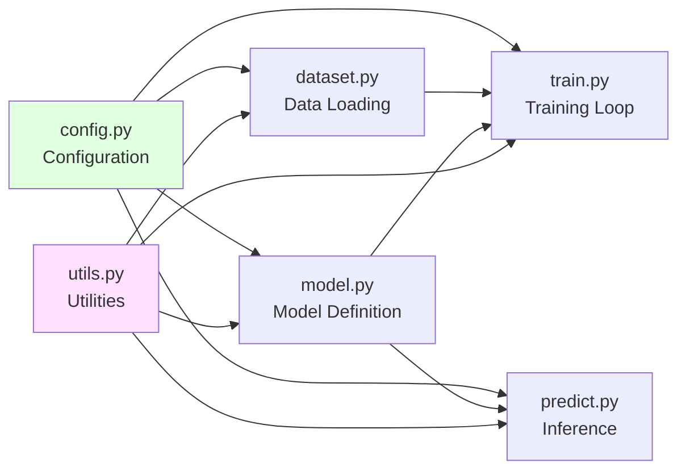
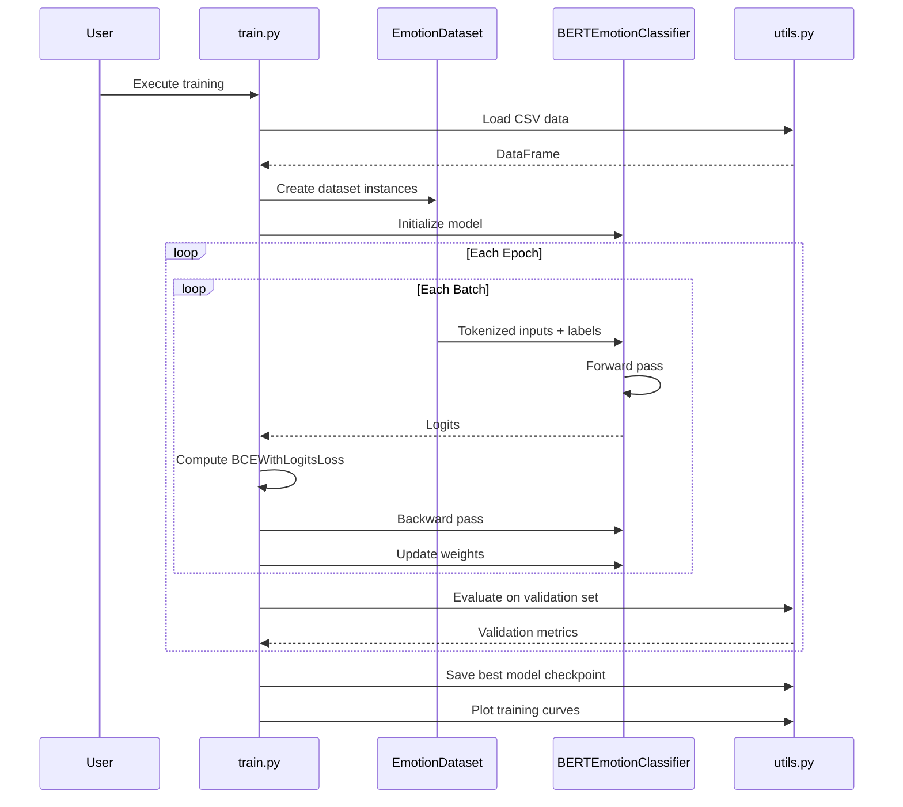

# Design Document: Multi-label Emotion Classification

## Overview

This document provides the technical design for a Multi-label Emotion Classification system that analyzes Vietnamese and English comment text to predict multiple emotions simultaneously. The system leverages BERT (Bidirectional Encoder Representations from Transformers), specifically the `bert-base-uncased` pre-trained model, combined with a custom classification head to identify up to 16 different emotions in user-generated text.

### System Purpose

The system enables nuanced sentiment analysis by recognizing that human emotions are complex and often overlapping. Unlike single-label classification, this multi-label approach allows a single comment to be tagged with multiple emotions (e.g., "joy" and "excited" simultaneously), providing richer emotional understanding for applications such as:

- Social media monitoring and analytics
- Customer feedback analysis
- Content moderation and community management
- Mental health and wellbeing assessment

### Key Technical Decisions

1. **BERT-based Architecture**: Using pre-trained `bert-base-uncased` provides strong contextual understanding of text through bidirectional attention mechanisms, enabling the model to capture nuanced emotional expressions.

2. **Multi-label Classification Approach**: Each of the 16 emotions is treated as an independent binary classification problem, allowing multiple emotions to be predicted simultaneously using sigmoid activation rather than softmax.

3. **BCEWithLogitsLoss**: This loss function combines sigmoid activation with binary cross-entropy loss in a numerically stable way, making it ideal for multi-label scenarios.

4. **Modular Architecture**: The system is organized into distinct modules (config, dataset, model, training, prediction, utilities) to ensure maintainability, testability, and extensibility.

## Architecture

### High-Level System Architecture



### Module Architecture

The system follows a modular design with clear separation of concerns:



### Data Flow Architecture



## Components and Interfaces

### 1. Configuration Module (config.py)

**Purpose**: Centralized configuration management for all system parameters.

**Key Components**:

```python
class Config:
    # Model Configuration
    MODEL_NAME = "bert-base-uncased"
    HIDDEN_SIZE = 768  # BERT base hidden dimension
    NUM_LABELS = 16
    DROPOUT_RATE = 0.3
    
    # Training Configuration
    LEARNING_RATE = 2e-5
    BATCH_SIZE = 16
    NUM_EPOCHS = 5
    MAX_LENGTH = 512  # Maximum token sequence length
    
    # Data Configuration
    DATA_DIR = "data/"
    MODEL_SAVE_DIR = "saved_model/"
    TRAIN_SPLIT = 0.7
    VAL_SPLIT = 0.15
    TEST_SPLIT = 0.15
    
    # Prediction Configuration
    PREDICTION_THRESHOLD = 0.5
    
    # Emotion Labels
    EMOTION_LABELS = [
        "joy", "trust", "fear", "surprise",
        "sadness", "disgust", "anger", "anticipation",
        "love", "worried", "disappointed", "proud",
        "embarrassed", "jealous", "calm", "excited"
    ]
    
    # Reproducibility
    RANDOM_SEED = 42
    
    # Device Configuration
    DEVICE = "cuda" if torch.cuda.is_available() else "cpu"
```

**Design Rationale**:
- Single source of truth for all configuration parameters
- Easy modification without code changes
- Supports experimentation with different hyperparameters
- Device-agnostic configuration with automatic GPU detection

### 2. Dataset Module (dataset.py)

**Purpose**: Custom PyTorch Dataset for loading and preprocessing emotion classification data.

**Key Classes**:

#### EmotionDataset

```python
class EmotionDataset(torch.utils.data.Dataset):
    """
    Custom Dataset for multi-label emotion classification.
    
    Attributes:
        texts (List[str]): List of comment texts
        labels (np.ndarray): Binary label matrix (N x 16)
        tokenizer (BertTokenizer): BERT tokenizer instance
        max_length (int): Maximum sequence length for tokenization
    """
    
    def __init__(self, texts, labels, tokenizer, max_length=512):
        self.texts = texts
        self.labels = labels
        self.tokenizer = tokenizer
        self.max_length = max_length
    
    def __len__(self):
        return len(self.texts)
    
    def __getitem__(self, idx):
        """
        Returns a single tokenized sample with labels.
        
        Returns:
            dict: {
                'input_ids': torch.Tensor,
                'attention_mask': torch.Tensor,
                'labels': torch.Tensor
            }
        """
```

**Interface Contract**:
- **Input**: Raw text strings and binary label arrays
- **Output**: Dictionary containing tokenized inputs and labels as PyTorch tensors
- **Tokenization**: Performed on-the-fly during data loading for memory efficiency

**Design Decisions**:
- Inherits from `torch.utils.data.Dataset` for compatibility with DataLoader
- On-the-fly tokenization reduces memory footprint
- Returns dictionaries for clear key-value mapping
- Supports batching through DataLoader

### 3. Model Module (model.py)

**Purpose**: Defines the BERT-based multi-label emotion classification model.

**Key Classes**:

#### BERTEmotionClassifier

```python
class BERTEmotionClassifier(nn.Module):
    """
    BERT-based multi-label emotion classifier.
    
    Architecture:
        BERT Base (bert-base-uncased)
        → Dropout (0.3)
        → Linear (768 → 16)
        → Sigmoid (applied during inference)
    
    Attributes:
        bert (BertModel): Pre-trained BERT model
        dropout (nn.Dropout): Dropout layer for regularization
        classifier (nn.Linear): Classification head
    """
    
    def __init__(self, num_labels=16, dropout_rate=0.3):
        super().__init__()
        self.bert = BertModel.from_pretrained('bert-base-uncased')
        self.dropout = nn.Dropout(dropout_rate)
        self.classifier = nn.Linear(768, num_labels)
    
    def forward(self, input_ids, attention_mask):
        """
        Forward pass through the model.
        
        Args:
            input_ids (torch.Tensor): Token IDs (batch_size, seq_length)
            attention_mask (torch.Tensor): Attention mask (batch_size, seq_length)
        
        Returns:
            torch.Tensor: Logits (batch_size, num_labels)
        """
```

**Architecture Details**:

1. **BERT Base Layer**:
   - Pre-trained `bert-base-uncased` with 12 transformer layers
   - 768-dimensional hidden states
   - Processes input through bidirectional attention
   - Uses [CLS] token representation for classification

2. **Dropout Layer**:
   - Rate: 0.3 (configurable)
   - Applied to [CLS] token output
   - Prevents overfitting during training

3. **Classification Head**:
   - Fully connected layer: 768 → 16
   - No activation in forward pass (logits output)
   - Sigmoid applied during inference or implicitly in loss function

**Why No Sigmoid in Forward Pass?**

The model outputs raw logits (unnormalized scores) rather than probabilities. This design choice is intentional:

- **Numerical Stability**: `BCEWithLogitsLoss` combines sigmoid and BCE loss using the log-sum-exp trick, which is more numerically stable than applying sigmoid separately
- **Training Efficiency**: Avoids redundant sigmoid computation during training
- **Flexibility**: Allows different thresholds during inference without retraining

### 4. Training Module (train.py)

**Purpose**: Orchestrates the model training process.

**Key Functions**:

#### train_epoch()

```python
def train_epoch(model, dataloader, optimizer, criterion, device):
    """
    Trains the model for one epoch.
    
    Args:
        model: BERTEmotionClassifier instance
        dataloader: Training DataLoader
        optimizer: AdamW optimizer
        criterion: BCEWithLogitsLoss
        device: torch.device
    
    Returns:
        float: Average training loss for the epoch
    """
```

#### evaluate()

```python
def evaluate(model, dataloader, criterion, device):
    """
    Evaluates the model on validation/test data.
    
    Args:
        model: BERTEmotionClassifier instance
        dataloader: Validation/Test DataLoader
        criterion: BCEWithLogitsLoss
        device: torch.device
    
    Returns:
        tuple: (average_loss, predictions, true_labels)
    """
```

#### main()

```python
def main():
    """
    Main training pipeline:
    1. Load and split data
    2. Create datasets and dataloaders
    3. Initialize model, optimizer, and loss function
    4. Training loop with validation
    5. Save best model checkpoint
    6. Plot training curves
    """
```

**Training Pipeline**:

1. **Data Preparation**:
   - Load CSV data
   - Split into train/val/test (70/15/15)
   - Create EmotionDataset instances
   - Wrap in DataLoader with batching and shuffling

2. **Model Initialization**:
   - Load pre-trained BERT
   - Initialize classification head
   - Move model to GPU if available

3. **Optimizer and Loss**:
   - AdamW optimizer with learning rate 2e-5
   - BCEWithLogitsLoss for multi-label classification

4. **Training Loop**:
   - Iterate through epochs
   - For each batch: forward pass → compute loss → backward pass → update weights
   - Evaluate on validation set after each epoch
   - Save checkpoint if validation loss improves

5. **Post-Training**:
   - Save best model
   - Generate loss curves
   - Log final metrics

### 5. Prediction Module (predict.py)

**Purpose**: Performs inference on new comments.

**Key Functions**:

#### predict_emotions()

```python
def predict_emotions(text, model, tokenizer, device, threshold=0.5):
    """
    Predicts emotions for a single comment.
    
    Args:
        text (str): Input comment
        model: Trained BERTEmotionClassifier
        tokenizer: BERT tokenizer
        device: torch.device
        threshold (float): Confidence threshold for prediction
    
    Returns:
        dict: {
            'emotions': List[str],  # Predicted emotion labels
            'scores': Dict[str, float]  # All confidence scores
        }
    """
```

**Inference Pipeline**:

1. **Preprocessing**: Clean and normalize input text
2. **Tokenization**: Convert text to BERT input format
3. **Forward Pass**: Generate logits
4. **Sigmoid Activation**: Convert logits to probabilities
5. **Thresholding**: Apply threshold (default 0.5) to determine predicted emotions
6. **Output Formatting**: Return emotions and confidence scores

### 6. Utilities Module (utils.py)

**Purpose**: Reusable helper functions for data processing, evaluation, and visualization.

**Key Functions**:

#### Text Processing

```python
def clean_text(text):
    """
    Cleans and normalizes comment text.
    
    Operations:
    - Remove/normalize URLs
    - Remove non-meaningful special characters
    - Normalize whitespace
    - Preserve emoticons and emoji
    - Convert to lowercase
    
    Args:
        text (str): Raw comment text
    
    Returns:
        str: Cleaned text
    """
```

#### Data Loading

```python
def load_data(file_path):
    """
    Loads emotion classification data from CSV.
    
    Expected CSV format:
    - 'text' column: comment text
    - 16 binary columns: one per emotion label
    
    Args:
        file_path (str): Path to CSV file
    
    Returns:
        tuple: (texts, labels)
    """
```

#### Evaluation Metrics

```python
def compute_metrics(predictions, labels, threshold=0.5):
    """
    Computes comprehensive evaluation metrics.
    
    Metrics:
    - Per-label: precision, recall, F1-score
    - Micro-averaged: F1, precision, recall
    - Macro-averaged: F1, precision, recall
    - Hamming loss
    
    Args:
        predictions (np.ndarray): Predicted probabilities (N x 16)
        labels (np.ndarray): True binary labels (N x 16)
        threshold (float): Threshold for binary conversion
    
    Returns:
        dict: Dictionary of metric values
    """
```

#### Visualization

```python
def plot_training_curves(train_losses, val_losses, save_path):
    """
    Plots and saves training/validation loss curves.
    
    Args:
        train_losses (List[float]): Training losses per epoch
        val_losses (List[float]): Validation losses per epoch
        save_path (str): Path to save plot
    """
```

#### Model Persistence

```python
def save_model(model, tokenizer, save_dir):
    """
    Saves model checkpoint and tokenizer.
    
    Args:
        model: BERTEmotionClassifier instance
        tokenizer: BERT tokenizer
        save_dir (str): Directory to save files
    """

def load_model(save_dir, device):
    """
    Loads model checkpoint and tokenizer.
    
    Args:
        save_dir (str): Directory containing saved files
        device: torch.device
    
    Returns:
        tuple: (model, tokenizer)
    """
```

## Data Models

### Input Data Format

**CSV Structure**:

```
text,joy,trust,fear,surprise,sadness,disgust,anger,anticipation,love,worried,disappointed,proud,embarrassed,jealous,calm,excited
"This product is amazing!",1,1,0,1,0,0,0,0,1,0,0,0,0,0,0,1
"I'm really disappointed with the service",0,0,0,0,1,1,1,0,0,1,1,0,0,0,0,0
```

**Schema**:
- **text** (string): Comment text (Vietnamese or English)
- **emotion columns** (binary): 16 columns, one per emotion (0 or 1)

### Tokenized Data Format

**BERT Tokenizer Output**:

```python
{
    'input_ids': torch.Tensor([101, 2023, 4031, 2003, 6429, 102, ...]),  # Token IDs
    'attention_mask': torch.Tensor([1, 1, 1, 1, 1, 1, ...]),  # Attention mask
    'token_type_ids': torch.Tensor([0, 0, 0, 0, 0, 0, ...])  # Segment IDs
}
```

**Dimensions**:
- `input_ids`: (batch_size, max_length)
- `attention_mask`: (batch_size, max_length)
- `token_type_ids`: (batch_size, max_length)

### Model Output Format

**Training Output (Logits)**:

```python
logits = model(input_ids, attention_mask)
# Shape: (batch_size, 16)
# Values: Unnormalized scores (can be any real number)
```

**Inference Output (Probabilities)**:

```python
probabilities = torch.sigmoid(logits)
# Shape: (batch_size, 16)
# Values: [0, 1] representing confidence for each emotion
```

**Prediction Output**:

```python
{
    'emotions': ['joy', 'excited', 'love'],  # Emotions above threshold
    'scores': {
        'joy': 0.92,
        'trust': 0.45,
        'fear': 0.03,
        ...
    }
}
```

### Model Checkpoint Format

**Saved Files**:

```
saved_model/
├── pytorch_model.bin          # Model weights
├── config.json                # Model configuration
├── tokenizer_config.json      # Tokenizer configuration
├── vocab.txt                  # BERT vocabulary
└── training_config.json       # Training hyperparameters
```

## Technical Deep Dive

### Multi-label Classification with Sigmoid

**Why Sigmoid Instead of Softmax?**

In multi-label classification, each label is independent. A comment can have multiple emotions simultaneously, so we need to predict each emotion independently.

**Sigmoid Function**:

```
σ(x) = 1 / (1 + e^(-x))
```

- Applied element-wise to each of the 16 logits
- Each output is independent: σ(x₁) doesn't affect σ(x₂)
- Outputs are in range [0, 1] and can be interpreted as probabilities
- Sum of outputs can be > 1 (unlike softmax)

**Softmax (NOT used here)**:

```
softmax(xᵢ) = e^(xᵢ) / Σⱼ e^(xⱼ)
```

- Forces outputs to sum to 1
- Suitable for single-label classification
- Creates competition between classes
- Not appropriate for multi-label scenarios

**Example**:

```python
logits = torch.tensor([2.5, -1.0, 3.2, 0.5])

# Sigmoid (multi-label)
sigmoid_probs = torch.sigmoid(logits)
# Output: [0.924, 0.269, 0.961, 0.622]
# Sum: 2.776 (can be > 1)

# Softmax (single-label)
softmax_probs = torch.softmax(logits, dim=0)
# Output: [0.387, 0.012, 0.776, 0.052]
# Sum: 1.0 (always sums to 1)
```

### BCEWithLogitsLoss Explained

**Binary Cross-Entropy Loss**:

For a single label:

```
BCE = -[y * log(p) + (1-y) * log(1-p)]
```

Where:
- y = true label (0 or 1)
- p = predicted probability

**Why BCEWithLogitsLoss?**

`BCEWithLogitsLoss` combines sigmoid activation and BCE loss in a single operation:

```python
# Naive approach (numerically unstable)
probs = torch.sigmoid(logits)
loss = F.binary_cross_entropy(probs, labels)

# Better approach (numerically stable)
loss = F.binary_cross_entropy_with_logits(logits, labels)
```

**Numerical Stability**:

The combined operation uses the log-sum-exp trick to avoid numerical issues:

```
BCE_with_logits(x, y) = max(x, 0) - x*y + log(1 + exp(-|x|))
```

This formulation:
- Avoids computing very small probabilities (near 0 or 1)
- Prevents log(0) errors
- Reduces floating-point precision errors

**Multi-label Application**:

For 16 emotions, the total loss is the mean of individual BCE losses:

```python
loss = BCEWithLogitsLoss()(logits, labels)
# Equivalent to:
# loss = mean([BCE(logit_i, label_i) for i in range(16)])
```

### BERT Architecture for Classification

**BERT Base Structure**:

```
Input: "This product is amazing!"
  ↓
Tokenization: [CLS] this product is amazing ! [SEP]
  ↓
Token Embeddings (768-dim)
  ↓
12 Transformer Layers
  ├─ Multi-Head Self-Attention
  ├─ Feed-Forward Network
  └─ Layer Normalization
  ↓
Output: Contextualized representations for each token
  ↓
[CLS] token representation → Used for classification
```

**Why [CLS] Token?**

- BERT prepends a special [CLS] token to every input
- During pre-training, [CLS] learns to aggregate sequence-level information
- The [CLS] output embedding serves as a fixed-size representation of the entire input
- Ideal for classification tasks

**Our Classification Head**:

```python
# Extract [CLS] token representation
cls_output = bert_output.last_hidden_state[:, 0, :]  # Shape: (batch_size, 768)

# Apply dropout
cls_output = dropout(cls_output)  # Shape: (batch_size, 768)

# Project to 16 emotion logits
logits = classifier(cls_output)  # Shape: (batch_size, 16)
```

### Training Process Details

**Optimization Strategy**:

1. **AdamW Optimizer**:
   - Variant of Adam with decoupled weight decay
   - Learning rate: 2e-5 (typical for BERT fine-tuning)
   - Weight decay: 0.01 (prevents overfitting)

2. **Learning Rate Schedule** (optional enhancement):
   - Warm-up: Gradually increase LR for first 10% of steps
   - Linear decay: Decrease LR to 0 by end of training

3. **Gradient Clipping**:
   - Clip gradients to max norm of 1.0
   - Prevents exploding gradients

**Training Loop Pseudocode**:

```python
for epoch in range(num_epochs):
    model.train()
    for batch in train_dataloader:
        # Forward pass
        logits = model(batch['input_ids'], batch['attention_mask'])
        loss = criterion(logits, batch['labels'])
        
        # Backward pass
        optimizer.zero_grad()
        loss.backward()
        torch.nn.utils.clip_grad_norm_(model.parameters(), 1.0)
        optimizer.step()
    
    # Validation
    model.eval()
    val_loss = evaluate(model, val_dataloader, criterion)
    
    # Save best model
    if val_loss < best_val_loss:
        save_model(model, tokenizer, save_dir)
        best_val_loss = val_loss
```

### Evaluation Metrics Explained

**Per-Label Metrics**:

For each emotion:

```
Precision = TP / (TP + FP)
Recall = TP / (TP + FN)
F1-Score = 2 * (Precision * Recall) / (Precision + Recall)
```

**Micro-Averaged Metrics**:

Aggregate all predictions across all labels:

```
Micro-F1 = 2 * (Micro-Precision * Micro-Recall) / (Micro-Precision + Micro-Recall)

Where:
Micro-Precision = Σ TP / (Σ TP + Σ FP)
Micro-Recall = Σ TP / (Σ TP + Σ FN)
```

- Treats all predictions equally
- Dominated by frequent labels
- Good for overall performance

**Macro-Averaged Metrics**:

Average metrics across all labels:

```
Macro-F1 = mean([F1_label_i for i in range(16)])
```

- Treats all labels equally
- Not dominated by frequent labels
- Good for balanced evaluation

**Hamming Loss**:

Fraction of incorrect label predictions:

```
Hamming Loss = (1 / N*L) * Σᵢ Σⱼ (yᵢⱼ ≠ ŷᵢⱼ)
```

Where:
- N = number of samples
- L = number of labels (16)
- yᵢⱼ = true label
- ŷᵢⱼ = predicted label

Lower is better (0 = perfect predictions).

## Project Structure

```
multi-label-emotion-classification/
│
├── data/
│   ├── sample_comments.csv          # Generated sample data
│   └── your_dataset.csv             # User-provided dataset
│
├── saved_model/
│   ├── pytorch_model.bin            # Trained model weights
│   ├── config.json                  # Model configuration
│   ├── tokenizer_config.json        # Tokenizer config
│   ├── vocab.txt                    # BERT vocabulary
│   ├── training_config.json         # Training hyperparameters
│   └── training_curves.png          # Loss curves plot
│
├── config.py                        # Configuration parameters
├── dataset.py                       # EmotionDataset class
├── model.py                         # BERTEmotionClassifier class
├── train.py                         # Training script
├── predict.py                       # Inference script
├── utils.py                         # Utility functions
│
├── requirements.txt                 # Python dependencies
├── README.md                        # Project documentation
└── .gitignore                       # Git ignore file
```

### File Responsibilities

| File | Purpose | Key Components |
|------|---------|----------------|
| `config.py` | Configuration management | Config class with all parameters |
| `dataset.py` | Data loading and preprocessing | EmotionDataset class |
| `model.py` | Model architecture | BERTEmotionClassifier class |
| `train.py` | Training orchestration | train_epoch(), evaluate(), main() |
| `predict.py` | Inference | predict_emotions(), interactive loop |
| `utils.py` | Helper functions | clean_text(), compute_metrics(), plot_training_curves() |

## Error Handling

### Error Categories and Handling Strategies

**1. Data Loading Errors**:

```python
try:
    df = pd.read_csv(file_path)
except FileNotFoundError:
    raise FileNotFoundError(f"Dataset not found at {file_path}. Please check the path.")
except pd.errors.EmptyDataError:
    raise ValueError("CSV file is empty.")
```

**2. Data Validation Errors**:

```python
required_columns = ['text'] + Config.EMOTION_LABELS
missing_columns = set(required_columns) - set(df.columns)
if missing_columns:
    raise ValueError(f"Missing required columns: {missing_columns}")
```

**3. Model Loading Errors**:

```python
if not os.path.exists(model_path):
    raise FileNotFoundError(
        f"Model checkpoint not found at {model_path}. "
        "Please train the model first using train.py"
    )
```

**4. Device Errors**:

```python
if Config.DEVICE == "cuda" and not torch.cuda.is_available():
    warnings.warn("CUDA requested but not available. Falling back to CPU.")
    Config.DEVICE = "cpu"
```

**5. Input Validation Errors**:

```python
def validate_input(text):
    if not text or not text.strip():
        raise ValueError("Input text cannot be empty.")
    if len(text) > 10000:
        warnings.warn("Input text is very long and will be truncated.")
    return text.strip()
```

## Testing Strategy

### Unit Testing

**Test Coverage Areas**:

1. **Text Preprocessing**:
   - Test URL removal
   - Test special character handling
   - Test whitespace normalization
   - Test emoticon preservation

2. **Dataset Class**:
   - Test `__len__()` returns correct length
   - Test `__getitem__()` returns correct format
   - Test tokenization produces expected shapes

3. **Model Architecture**:
   - Test model initialization
   - Test forward pass output shapes
   - Test model can be saved and loaded

4. **Utility Functions**:
   - Test metric calculations with known inputs
   - Test data loading with sample CSV
   - Test model persistence

**Example Unit Test**:

```python
def test_clean_text():
    # Test URL removal
    text = "Check this out https://example.com great!"
    cleaned = clean_text(text)
    assert "https://" not in cleaned
    
    # Test whitespace normalization
    text = "Too    many     spaces"
    cleaned = clean_text(text)
    assert "  " not in cleaned
    
    # Test emoticon preservation
    text = "I'm happy :) and excited!"
    cleaned = clean_text(text)
    assert ":)" in cleaned
```

### Integration Testing

**Test Scenarios**:

1. **End-to-End Training**:
   - Load sample data
   - Train for 1 epoch
   - Verify model checkpoint is saved
   - Verify loss decreases

2. **End-to-End Prediction**:
   - Load trained model
   - Predict on sample comments
   - Verify output format
   - Verify predictions are reasonable

3. **Data Pipeline**:
   - Load CSV → Create Dataset → Create DataLoader
   - Verify batching works correctly
   - Verify data types are correct

### Manual Testing

**Test Cases**:

1. **Positive Emotions**:
   - Input: "I love this product! It's amazing and exceeded my expectations!"
   - Expected: joy, love, excited, trust

2. **Negative Emotions**:
   - Input: "This is terrible. I'm very disappointed and angry."
   - Expected: anger, disappointed, sadness, disgust

3. **Mixed Emotions**:
   - Input: "I'm worried but also hopeful about the outcome."
   - Expected: worried, anticipation, fear

4. **Neutral/Calm**:
   - Input: "The product works as described. No issues."
   - Expected: calm, trust

5. **Vietnamese Text**:
   - Input: "Tôi rất vui và hạnh phúc với sản phẩm này!"
   - Expected: joy, love, excited

**Note**: BERT base-uncased is primarily trained on English. For better Vietnamese support, consider using multilingual BERT (mBERT) or XLM-RoBERTa in future iterations.

## Dependencies

### Core Dependencies

```
torch>=2.0.0                    # PyTorch deep learning framework
transformers>=4.30.0            # Hugging Face transformers (BERT)
pandas>=2.0.0                   # Data manipulation
numpy>=1.24.0                   # Numerical operations
scikit-learn>=1.3.0             # Metrics and evaluation
matplotlib>=3.7.0               # Visualization
tqdm>=4.65.0                    # Progress bars
```

### Development Dependencies

```
pytest>=7.4.0                   # Testing framework
black>=23.0.0                   # Code formatting
flake8>=6.0.0                   # Linting
jupyter>=1.0.0                  # Notebook support
```

### Installation

```bash
pip install -r requirements.txt
```

## Performance Considerations

### Memory Optimization

1. **Batch Size**:
   - Default: 16
   - Reduce if GPU memory is limited
   - Increase if GPU memory allows (faster training)

2. **Gradient Accumulation** (optional):
   - Simulate larger batch sizes
   - Accumulate gradients over multiple batches before updating

3. **Mixed Precision Training** (optional):
   - Use `torch.cuda.amp` for FP16 training
   - Reduces memory usage by ~50%
   - Speeds up training on modern GPUs

### Training Time Estimates

**On GPU (NVIDIA RTX 3080)**:
- 1000 samples: ~2-3 minutes per epoch
- 10000 samples: ~15-20 minutes per epoch
- 100000 samples: ~2-3 hours per epoch

**On CPU**:
- 1000 samples: ~15-20 minutes per epoch
- 10000 samples: ~2-3 hours per epoch
- Not recommended for large datasets

### Inference Speed

**Single Prediction**:
- GPU: ~10-20ms
- CPU: ~100-200ms

**Batch Prediction (32 samples)**:
- GPU: ~50-100ms
- CPU: ~1-2 seconds

## Future Enhancements

### Model Improvements

1. **Multilingual Support**:
   - Replace `bert-base-uncased` with `bert-base-multilingual-cased`
   - Better support for Vietnamese and other languages

2. **Larger Models**:
   - Use `bert-large` (24 layers, 1024 hidden size)
   - Use RoBERTa or XLM-RoBERTa for better performance

3. **Domain Adaptation**:
   - Continue pre-training BERT on domain-specific data
   - Fine-tune on emotion-specific corpora

### Feature Enhancements

1. **Confidence Calibration**:
   - Apply temperature scaling to improve probability estimates
   - Better threshold selection based on calibration

2. **Explainability**:
   - Implement attention visualization
   - Show which words contribute to each emotion prediction

3. **Active Learning**:
   - Identify uncertain predictions
   - Request human labels for uncertain samples

4. **API Deployment**:
   - Create REST API using FastAPI or Flask
   - Deploy on cloud platforms (AWS, GCP, Azure)

5. **Real-time Processing**:
   - Implement streaming inference
   - Process social media feeds in real-time

### Data Enhancements

1. **Data Augmentation**:
   - Back-translation for text augmentation
   - Synonym replacement
   - Random insertion/deletion

2. **Class Balancing**:
   - Handle imbalanced emotion distributions
   - Use weighted loss or oversampling

3. **Hierarchical Emotions**:
   - Model emotion hierarchies (e.g., joy → excited)
   - Use hierarchical loss functions


## Correctness Properties

Property-based testing is not applicable to this feature. The Multi-label Emotion Classification system is primarily a deep learning application with the following characteristics that make it unsuitable for PBT:

1. **Non-deterministic Training**: Neural network training involves stochastic processes (random weight initialization, dropout, batch shuffling) that produce different results across runs, even with fixed seeds.

2. **Learned Behavior**: Model predictions are based on learned weights rather than algorithmic logic with universal properties. There are no "for all inputs X, property P(X) holds" statements that can be meaningfully tested.

3. **External Dependencies**: The system heavily relies on PyTorch, Hugging Face Transformers, and BERT pre-trained models. Testing focuses on integration with these frameworks rather than universal properties of our code.

4. **Side-Effect Operations**: Core functionality involves file I/O (loading data, saving models), GPU operations, and network calls (downloading pre-trained models), which are not suitable for property-based testing.

**Alternative Testing Approach**:

Instead of property-based testing, this system will use:

- **Unit Tests**: Test individual utility functions (text cleaning, metric calculations) with concrete examples
- **Integration Tests**: Test end-to-end workflows (data loading → training → prediction) with sample datasets
- **Model Evaluation**: Use standard ML metrics (precision, recall, F1-score) on held-out test data
- **Regression Tests**: Ensure model performance doesn't degrade across code changes
- **Manual Testing**: Validate predictions on diverse comment examples

This approach is more appropriate for machine learning systems where correctness is measured through empirical evaluation rather than formal properties.


## Error Handling Strategy

### Error Categories and Responses

#### 1. Data-Related Errors

**File Not Found**:
```python
if not os.path.exists(data_path):
    raise FileNotFoundError(
        f"Dataset file not found at '{data_path}'. "
        f"Please ensure the file exists or run the sample data generator."
    )
```

**Invalid CSV Format**:
```python
required_columns = ['text'] + Config.EMOTION_LABELS
missing = set(required_columns) - set(df.columns)
if missing:
    raise ValueError(
        f"CSV is missing required columns: {missing}. "
        f"Expected columns: {required_columns}"
    )
```

**Empty Dataset**:
```python
if len(df) == 0:
    raise ValueError("Dataset is empty. Please provide data with at least one sample.")
```

**Invalid Label Values**:
```python
for label in Config.EMOTION_LABELS:
    if not df[label].isin([0, 1]).all():
        raise ValueError(
            f"Column '{label}' contains non-binary values. "
            f"All emotion labels must be 0 or 1."
        )
```

#### 2. Model-Related Errors

**Model Checkpoint Not Found**:
```python
if not os.path.exists(checkpoint_path):
    raise FileNotFoundError(
        f"Model checkpoint not found at '{checkpoint_path}'. "
        f"Please train the model first by running: python train.py"
    )
```

**Model Loading Failure**:
```python
try:
    model = BERTEmotionClassifier.from_pretrained(checkpoint_path)
except Exception as e:
    raise RuntimeError(
        f"Failed to load model from '{checkpoint_path}': {str(e)}. "
        f"The checkpoint may be corrupted. Please retrain the model."
    )
```

**BERT Download Failure**:
```python
try:
    bert_model = BertModel.from_pretrained('bert-base-uncased')
except Exception as e:
    raise ConnectionError(
        f"Failed to download BERT model: {str(e)}. "
        f"Please check your internet connection and try again."
    )
```

#### 3. Hardware-Related Errors

**GPU Not Available**:
```python
if Config.DEVICE == "cuda" and not torch.cuda.is_available():
    warnings.warn(
        "CUDA requested but not available. Falling back to CPU. "
        "Training will be significantly slower."
    )
    Config.DEVICE = "cpu"
```

**Out of Memory**:
```python
try:
    loss.backward()
except RuntimeError as e:
    if "out of memory" in str(e):
        raise RuntimeError(
            "GPU out of memory. Try reducing batch size in config.py. "
            f"Current batch size: {Config.BATCH_SIZE}. "
            f"Suggested: {Config.BATCH_SIZE // 2}"
        )
    raise
```

#### 4. Input Validation Errors

**Empty Input Text**:
```python
def validate_input(text):
    if not text or not text.strip():
        raise ValueError("Input text cannot be empty. Please provide a valid comment.")
    return text.strip()
```

**Excessively Long Input**:
```python
if len(text) > 10000:
    warnings.warn(
        f"Input text is very long ({len(text)} characters). "
        f"It will be truncated to {Config.MAX_LENGTH} tokens."
    )
```

#### 5. Training Errors

**Invalid Hyperparameters**:
```python
if Config.LEARNING_RATE <= 0:
    raise ValueError(f"Learning rate must be positive. Got: {Config.LEARNING_RATE}")

if Config.BATCH_SIZE <= 0:
    raise ValueError(f"Batch size must be positive. Got: {Config.BATCH_SIZE}")

if Config.NUM_EPOCHS <= 0:
    raise ValueError(f"Number of epochs must be positive. Got: {Config.NUM_EPOCHS}")
```

**Training Divergence**:
```python
if loss > 100 or math.isnan(loss):
    raise RuntimeError(
        f"Training loss diverged (loss={loss}). "
        f"Try reducing learning rate or checking data quality."
    )
```

### Error Handling Best Practices

1. **Descriptive Messages**: All error messages include:
   - What went wrong
   - Why it happened (if known)
   - How to fix it

2. **Graceful Degradation**: System falls back to CPU if GPU unavailable, warns but continues

3. **Early Validation**: Validate inputs and configuration before expensive operations

4. **Logging**: Log errors with context for debugging:
```python
import logging
logging.error(f"Failed to load data from {path}: {str(e)}", exc_info=True)
```

5. **User-Friendly**: Avoid technical jargon in user-facing error messages

## Testing Strategy

### Overview

The testing strategy for this system combines multiple testing approaches appropriate for machine learning applications:

1. **Unit Tests**: Test individual functions and components
2. **Integration Tests**: Test end-to-end workflows
3. **Model Evaluation Tests**: Validate model performance on test data
4. **Manual Testing**: Human validation of predictions

**Why No Property-Based Testing?**

As explained in the Correctness Properties section, this deep learning system is not suitable for property-based testing due to its non-deterministic nature, learned behavior, and heavy reliance on external frameworks. Instead, we focus on empirical evaluation and integration testing.

### Unit Testing

**Scope**: Test individual utility functions and components in isolation.

#### Text Preprocessing Tests

```python
def test_clean_text_removes_urls():
    text = "Check this https://example.com out!"
    cleaned = clean_text(text)
    assert "https://" not in cleaned
    assert "example.com" not in cleaned

def test_clean_text_normalizes_whitespace():
    text = "Too    many     spaces"
    cleaned = clean_text(text)
    assert "  " not in cleaned

def test_clean_text_preserves_emoticons():
    text = "I'm happy :) and sad :("
    cleaned = clean_text(text)
    assert ":)" in cleaned
    assert ":(" in cleaned

def test_clean_text_converts_to_lowercase():
    text = "HELLO World"
    cleaned = clean_text(text)
    assert cleaned == "hello world"
```

#### Dataset Tests

```python
def test_emotion_dataset_length():
    texts = ["text1", "text2", "text3"]
    labels = np.array([[1,0,0,0,0,0,0,0,0,0,0,0,0,0,0,0]] * 3)
    tokenizer = BertTokenizer.from_pretrained('bert-base-uncased')
    dataset = EmotionDataset(texts, labels, tokenizer)
    assert len(dataset) == 3

def test_emotion_dataset_getitem_format():
    texts = ["test text"]
    labels = np.array([[1,0,0,0,0,0,0,0,0,0,0,0,0,0,0,0]])
    tokenizer = BertTokenizer.from_pretrained('bert-base-uncased')
    dataset = EmotionDataset(texts, labels, tokenizer)
    
    item = dataset[0]
    assert 'input_ids' in item
    assert 'attention_mask' in item
    assert 'labels' in item
    assert item['input_ids'].shape[0] <= 512
    assert item['labels'].shape[0] == 16
```

#### Model Architecture Tests

```python
def test_model_initialization():
    model = BERTEmotionClassifier(num_labels=16, dropout_rate=0.3)
    assert model.classifier.out_features == 16

def test_model_forward_pass_shape():
    model = BERTEmotionClassifier(num_labels=16)
    input_ids = torch.randint(0, 1000, (2, 128))  # batch_size=2, seq_len=128
    attention_mask = torch.ones(2, 128)
    
    logits = model(input_ids, attention_mask)
    assert logits.shape == (2, 16)

def test_model_save_and_load():
    model = BERTEmotionClassifier(num_labels=16)
    save_path = "test_model"
    
    # Save
    torch.save(model.state_dict(), save_path)
    
    # Load
    loaded_model = BERTEmotionClassifier(num_labels=16)
    loaded_model.load_state_dict(torch.load(save_path))
    
    # Cleanup
    os.remove(save_path)
```

#### Metrics Tests

```python
def test_compute_metrics_perfect_predictions():
    predictions = np.array([[0.9, 0.1], [0.1, 0.9]])
    labels = np.array([[1, 0], [0, 1]])
    
    metrics = compute_metrics(predictions, labels, threshold=0.5)
    assert metrics['micro_f1'] == 1.0
    assert metrics['hamming_loss'] == 0.0

def test_compute_metrics_all_wrong():
    predictions = np.array([[0.9, 0.1], [0.9, 0.1]])
    labels = np.array([[0, 1], [0, 1]])
    
    metrics = compute_metrics(predictions, labels, threshold=0.5)
    assert metrics['micro_f1'] == 0.0
    assert metrics['hamming_loss'] == 1.0
```

### Integration Testing

**Scope**: Test complete workflows from end to end.

#### End-to-End Training Test

```python
def test_training_pipeline():
    """Test complete training pipeline with minimal data."""
    # Create minimal sample data
    texts = ["happy text"] * 10 + ["sad text"] * 10
    labels = np.array([[1,0,0,0,0,0,0,0,0,0,0,0,0,0,0,0]] * 10 +
                      [[0,0,0,0,1,0,0,0,0,0,0,0,0,0,0,0]] * 10)
    
    # Save to CSV
    df = pd.DataFrame({'text': texts})
    for i, label in enumerate(Config.EMOTION_LABELS):
        df[label] = labels[:, i]
    df.to_csv('test_data.csv', index=False)
    
    # Run training for 1 epoch
    Config.NUM_EPOCHS = 1
    Config.BATCH_SIZE = 4
    
    # Train
    train_main()  # Calls main() from train.py
    
    # Verify model was saved
    assert os.path.exists(Config.MODEL_SAVE_DIR + '/pytorch_model.bin')
    
    # Cleanup
    os.remove('test_data.csv')
    shutil.rmtree(Config.MODEL_SAVE_DIR)
```

#### End-to-End Prediction Test

```python
def test_prediction_pipeline():
    """Test complete prediction pipeline."""
    # Assume model is trained
    text = "I love this product!"
    
    # Load model
    model, tokenizer = load_model(Config.MODEL_SAVE_DIR, Config.DEVICE)
    
    # Predict
    result = predict_emotions(text, model, tokenizer, Config.DEVICE)
    
    # Verify output format
    assert 'emotions' in result
    assert 'scores' in result
    assert isinstance(result['emotions'], list)
    assert isinstance(result['scores'], dict)
    assert len(result['scores']) == 16
    
    # Verify scores are probabilities
    for score in result['scores'].values():
        assert 0 <= score <= 1
```

#### Data Pipeline Test

```python
def test_data_loading_pipeline():
    """Test data loading and DataLoader creation."""
    # Create sample CSV
    df = pd.DataFrame({
        'text': ['text1', 'text2', 'text3'],
        **{label: [0, 1, 0] for label in Config.EMOTION_LABELS}
    })
    df.to_csv('test_data.csv', index=False)
    
    # Load data
    texts, labels = load_data('test_data.csv')
    
    # Create dataset
    tokenizer = BertTokenizer.from_pretrained('bert-base-uncased')
    dataset = EmotionDataset(texts, labels, tokenizer)
    
    # Create dataloader
    dataloader = DataLoader(dataset, batch_size=2, shuffle=True)
    
    # Verify batching works
    batch = next(iter(dataloader))
    assert batch['input_ids'].shape[0] == 2
    assert batch['labels'].shape == (2, 16)
    
    # Cleanup
    os.remove('test_data.csv')
```

### Model Evaluation Testing

**Scope**: Validate model performance on held-out test data.

#### Performance Benchmarks

```python
def test_model_performance_on_test_set():
    """Ensure model meets minimum performance thresholds."""
    # Load test data
    test_texts, test_labels = load_data('data/test_set.csv')
    
    # Load trained model
    model, tokenizer = load_model(Config.MODEL_SAVE_DIR, Config.DEVICE)
    
    # Create test dataset and dataloader
    test_dataset = EmotionDataset(test_texts, test_labels, tokenizer)
    test_loader = DataLoader(test_dataset, batch_size=32)
    
    # Evaluate
    predictions, true_labels = evaluate_model(model, test_loader, Config.DEVICE)
    metrics = compute_metrics(predictions, true_labels)
    
    # Assert minimum performance
    assert metrics['micro_f1'] >= 0.60, f"Micro-F1 too low: {metrics['micro_f1']}"
    assert metrics['macro_f1'] >= 0.50, f"Macro-F1 too low: {metrics['macro_f1']}"
    assert metrics['hamming_loss'] <= 0.15, f"Hamming loss too high: {metrics['hamming_loss']}"
```

#### Regression Testing

```python
def test_model_performance_regression():
    """Ensure model performance doesn't degrade across code changes."""
    # Load baseline metrics (from previous run)
    with open('baseline_metrics.json', 'r') as f:
        baseline = json.load(f)
    
    # Evaluate current model
    current_metrics = evaluate_current_model()
    
    # Assert no significant degradation (allow 2% tolerance)
    assert current_metrics['micro_f1'] >= baseline['micro_f1'] - 0.02
    assert current_metrics['macro_f1'] >= baseline['macro_f1'] - 0.02
```

### Manual Testing

**Scope**: Human validation of model predictions on diverse examples.

#### Test Cases

**1. Positive Emotions**:
```
Input: "I absolutely love this! It exceeded all my expectations and made me so happy!"
Expected Emotions: joy, love, excited, trust
Validation: ✓ Check if predicted emotions match expected
```

**2. Negative Emotions**:
```
Input: "This is terrible. I'm very disappointed and angry with the poor quality."
Expected Emotions: anger, disappointed, sadness, disgust
Validation: ✓ Check if predicted emotions match expected
```

**3. Mixed Emotions**:
```
Input: "I'm worried about the outcome but also hopeful and anticipating good results."
Expected Emotions: worried, anticipation, fear (low), trust
Validation: ✓ Check if model captures emotional complexity
```

**4. Neutral/Calm**:
```
Input: "The product works as described. No issues so far."
Expected Emotions: calm, trust
Validation: ✓ Check if model correctly identifies neutral tone
```

**5. Subtle Emotions**:
```
Input: "I feel a bit embarrassed to admit I was jealous of their success."
Expected Emotions: embarrassed, jealous
Validation: ✓ Check if model detects subtle emotions
```

**6. Vietnamese Text**:
```
Input: "Tôi rất vui và hạnh phúc với sản phẩm này! Tuyệt vời!"
Expected Emotions: joy, love, excited
Validation: ✓ Check Vietnamese language support (may be limited with bert-base-uncased)
```

**7. Sarcasm/Irony** (challenging):
```
Input: "Oh great, another broken product. Just what I needed."
Expected Emotions: anger, disappointed, disgust (not joy)
Validation: ✓ Check if model handles sarcasm (known limitation)
```

#### Manual Testing Procedure

1. **Prepare Test Set**: Create a diverse set of 50-100 comments covering all 16 emotions
2. **Run Predictions**: Use predict.py to generate predictions for all test comments
3. **Human Review**: Have 2-3 reviewers independently label the comments
4. **Compare**: Calculate agreement between model and human reviewers
5. **Analyze Errors**: Identify patterns in misclassifications
6. **Document**: Record findings and edge cases for future improvement

### Test Execution

**Running Unit Tests**:
```bash
pytest tests/test_utils.py -v
pytest tests/test_dataset.py -v
pytest tests/test_model.py -v
```

**Running Integration Tests**:
```bash
pytest tests/test_integration.py -v --slow
```

**Running All Tests**:
```bash
pytest tests/ -v
```

**Test Coverage**:
```bash
pytest --cov=. --cov-report=html tests/
```

### Continuous Integration

**CI Pipeline** (GitHub Actions example):

```yaml
name: Tests

on: [push, pull_request]

jobs:
  test:
    runs-on: ubuntu-latest
    steps:
      - uses: actions/checkout@v2
      - name: Set up Python
        uses: actions/setup-python@v2
        with:
          python-version: 3.9
      - name: Install dependencies
        run: |
          pip install -r requirements.txt
          pip install pytest pytest-cov
      - name: Run unit tests
        run: pytest tests/ -v --cov=.
      - name: Check code style
        run: |
          pip install black flake8
          black --check .
          flake8 .
```

### Test Maintenance

1. **Update Tests**: When requirements change, update corresponding tests
2. **Add Tests**: For each bug fix, add a regression test
3. **Review Coverage**: Aim for >80% code coverage on utility functions
4. **Performance Baselines**: Update baseline metrics after intentional model improvements

## Summary

This design document provides a comprehensive technical blueprint for the Multi-label Emotion Classification system. Key highlights:

- **Modular Architecture**: Clear separation of concerns across config, dataset, model, training, prediction, and utilities
- **BERT-based Model**: Leverages pre-trained `bert-base-uncased` with custom classification head for 16 emotions
- **Multi-label Approach**: Uses sigmoid activation and BCEWithLogitsLoss for independent emotion predictions
- **Robust Error Handling**: Comprehensive error detection and user-friendly error messages
- **Comprehensive Testing**: Unit tests, integration tests, model evaluation, and manual testing strategies
- **Production-Ready**: Includes performance considerations, dependencies, and future enhancement paths

The system is designed to be maintainable, extensible, and suitable for real-world deployment in sentiment analysis applications.

